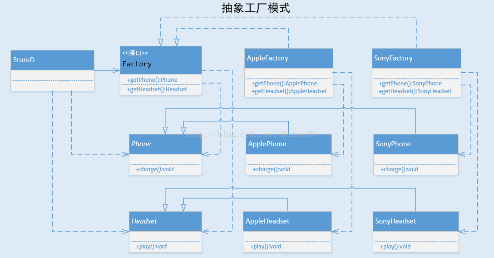

### 类图：
简单工厂模式由SimplePhoneFactory，集中获取不同的手机实例对象。

工厂方法模式由PhoneFactory的两个实现，分别获取不同的手机实例对象。

### 对比：
当要新增其它品牌的手机时，简单工厂模式的SimplePhoneFactory类需要修改getPhone方法代码
工厂方法模式只需增加PhoneFactory的实现即可

### 抽象工厂:
从代码看，如果要从StoreC，StoreD中，选一个来实例化不同的专卖店，
抽象工厂中的StoreD更适合，只要在构造方法那传入不同的单个Factory，即可获得不同的专卖店。
而工厂方法中的StoreC，如果现在有耳机、手机、电脑、电视等等，那用StoreC实例化每个店，都得传入很多Factory，且得注意这些Factory都是同一品牌的。

小结：
* 一类产品有多种不同实例对象（本例的手机，有不同品牌），当新增一种实例对象时（新增一个品牌的手机），工厂方法模式符合 对扩展开放，对修改封闭原则。
* 多类产品分别有多种不同实例对象（本例的手机，耳机都分别有不同品牌），而跨类别的实例对象有联系（本例的联系是同一品牌），暂且称有联系的那些实例对象为同一族。那抽象工厂模式可以让产品用户更方便获取同一族的产品。