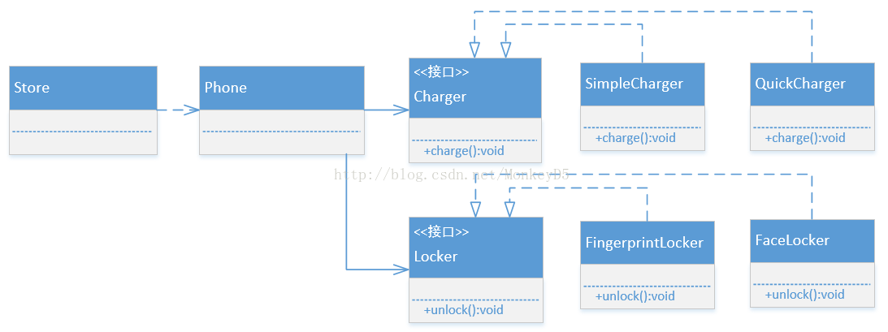

### 类图

用了桥接模式的话，Store就可以随意组合出所需的手机种类。

大家可能问，用户类Store要是更换其它种类手机，就得修改代码

这问题就牵涉到 如何获取实例对象 问题，桥接模式解决的只是如何处理实例对象依赖 问题。（后面将提到如何结合 工厂方法模式，建造者模式 来方便获取不同的手机）

此时若新增 照相功能（takePicture）

此时Phone类只需增加一个takePicture方法，而且Store类，只修改了getNokiaPhone的方法（因为只有Nokia需要加照相功能），没有影响到其它方法。
小结：一类产品（本例的Phone）若多维上有多个不同实现（charge、camera、takePicture等方法都有多个实现）。此时若使用继承，会出现 代码难以重用、新增维度不方便 等问题，此时适合使用桥接模式